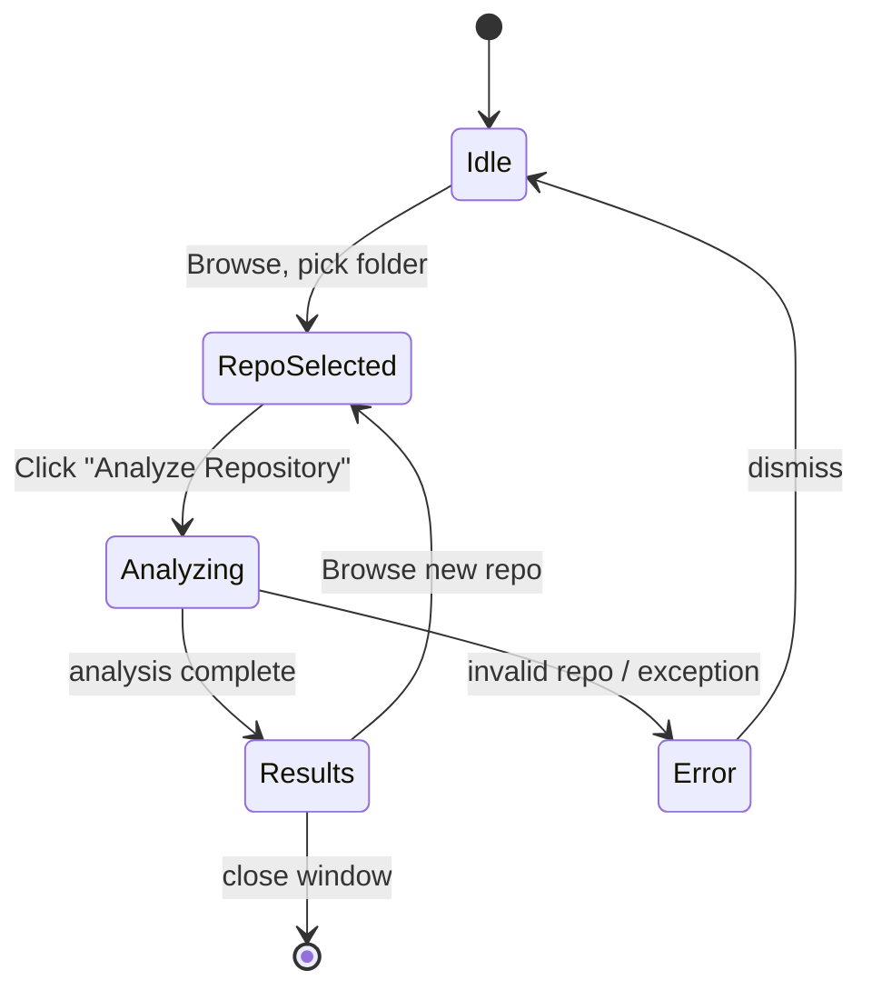

# Functional Analysis

Describes **what** `mahamudra-ai-code-detector` means in business terms: purpose, signal semantics, risk classification, use cases, user workflows, and limitations.

For how it is built — architecture, algorithms, code layout — see [analisi-tecnica.md](analisi-tecnica.md).

## Table of contents

1. [Purpose and philosophy](#purpose-and-philosophy)
2. [Risk levels](#risk-levels)
3. [Detection signals](#detection-signals)
4. [Bot signatures](#bot-signatures)
5. [Supported languages](#supported-languages)
6. [Use cases](#use-cases)
7. [GUI workflow](#gui-workflow)
8. [CLI workflow](#cli-workflow)
9. [Interpreting results](#interpreting-results)
10. [Limits](#limits)

## Purpose and philosophy

The tool estimates **where AI coding assistants (Copilot, Claude Code, Cursor, ChatGPT-based tools) were likely involved in writing or editing code** in a git repository.

It is an **aid for auditing and code review**, not a forensic instrument. The goal is to support human reviewers, compliance checks, and governance around AI usage — not to police individual developers.

Three guiding principles:

- **Probabilistic**, not proof. The output is a likelihood score, not a verdict.
- **Composite evidence**. No single signal is decisive; the score combines metadata, code heuristics, and similarity matching.
- **Human in the loop**. Results are meant to guide reviewers to files that deserve a closer look, not to replace review.

## Risk levels

Every analyzed file receives a likelihood score in `[0, 1]`, mapped to one of three risk levels:

| Level | Range | Meaning | Suggested action |
|---|---|---|---|
| 🟢 Low | < 40% | Likely human-written, minimal AI signals | No action needed |
| 🟡 Medium | 40–70% | Some AI indicators (comments, style, single signal) | Spot-check during review |
| 🔴 High | > 70% | Multiple strong AI indicators | Review carefully; check author, diff, comments |

Thresholds are configurable per `ReportGenerator` instance (see [analisi-tecnica.md](analisi-tecnica.md#detector-parameters)). Defaults are 0.40 / 0.70.

## Detection signals

When a file is flagged, the report lists which heuristics fired. Each signal has a semantic meaning:

| Signal | What it measures | Fires when |
|---|---|---|
| `bot_author` | Commit authored by a known AI tool | Author name / email / commit message matches a bot signature (see below) |
| `change_velocity` | Commit size relative to normal activity | A single commit inserts more than `insertion_threshold` lines (default 500), or many large commits happen in a burst |
| `pr_pattern` | One-shot PRs with minimal interaction | A PR is merged with no review rounds, no discussion, large size |
| `comment_density` | Ratio of comment lines to code lines | Density exceeds `high_density_threshold` (default 30%) and the file has meaningful size |
| `style_uniformity` | Over-consistent formatting | Indentation, naming, line length are more uniform than a typical human-written file |
| `repetition` | Internal repeated / near-duplicate blocks | Several code chunks exceed the Jaccard similarity threshold (default 0.8) |
| `similarity` | External match against known AI or FOSS patterns | A chunk's fingerprint matches an entry in the configured similarity index |

Signals are **not** mutually exclusive: the same file can trigger several. The aggregator weights them to produce the final score.

## Bot signatures

Out of the box, the detector recognizes commits by these tools via author name, email domain, or commit footer markers:

| Tool | Matches |
|---|---|
| GitHub Copilot | `github-copilot[bot]`, `copilot`, emails from `@users.noreply.github.com` with copilot pattern |
| Claude Code | `claude-code`, `claude code`, `anthropic`, `Co-Authored-By: Claude` |
| Cursor | `cursor` |
| ChatGPT-based tools | `chatgpt`, `openai` |

Signatures are extensible at runtime — see [analisi-tecnica.md](analisi-tecnica.md#extending-bot-signatures).

## Supported languages

Comment detection and style heuristics work across a broad set of languages thanks to language-agnostic prefix matching (`#`, `//`, `/* */`, `<!-- -->`, `--`, leading `*`).

| Language | Single-line | Block |
|---|---|---|
| Python | `#` | `"""..."""` (as string) |
| C / C++ / C# / Java | `//` | `/* */` |
| JavaScript / TypeScript | `//` | `/* */` |
| Go / Rust | `//` | `/* */` |
| CSS | — | `/* */` |
| HTML / XML | — | `<!-- -->` |
| SQL | `--` | `/* */` |
| Shell / Ruby | `#` | — |

Git metadata signals (bot authors, velocity, PR patterns) are language-independent by construction.

## Use cases

### Auditing an open-source project

Clone a repository and analyze it before adopting, forking, or contributing. The report flags files that are likely AI-generated, which matters for licensing, review discipline, and quality expectations.

### Team code review

Run on internal repositories before release or sprint close. Files flagged as high risk get explicit attention during review. Useful for teams with internal policies on AI tool usage.

### CI/CD integration

Run as a gate in a pipeline, parse the JSON output, fail the build if the AI-flagged percentage exceeds a threshold. Example (GitHub Actions):

```yaml
- name: AI code audit
  run: mahamudra-detector . --output json -f ai-report.json

- name: Enforce AI code threshold
  run: |
    python -c "
    import json, sys
    with open('ai-report.json') as f:
        r = json.load(f)
    if r['summary']['ai_risk_percentage'] > 50:
        sys.exit('Too much AI-flagged code')
    "
```

### Compliance and governance

Produce periodic audit reports for governance frameworks that require visibility on AI-assisted code. The JSON output is the stable integration surface.

## GUI workflow



Step-by-step:

1. **Launch** — `python run_ui.py` or `mahamudra-detector-ui`
2. **Select repo** — click **Browse**, pick a folder containing a `.git/` directory
3. **Browse files** — the left sidebar shows the repository tree; filter with the search box
4. **Analyze** — click **Analyze Repository** on the right panel; a background thread runs the pipeline
5. **Read results** — the right panel shows:
   - The overall score with a traffic-light badge (green / yellow / red)
   - The risk distribution (counts per level)
   - A scrollable list of flagged files with per-file score, language, signals that fired

The UI remains responsive during analysis — the pipeline runs in a worker thread, not on the Tk main loop.

## CLI workflow

```bash
# Terminal report
mahamudra-detector /path/to/repo

# JSON export for automation
mahamudra-detector /path/to/repo --output json -f report.json

# Verbose (see every signal that fires)
mahamudra-detector /path/to/repo -v

# Skip similarity (faster on large repos)
mahamudra-detector /path/to/repo --disable-similarity
```

Output layout: repo metadata → risk distribution → high-risk table → medium-risk table → recommendations.

## Interpreting results

Not every flagged file is AI-generated — the detector surfaces **candidates for review**. Rules of thumb when reading a report:

- **Single signal, low confidence** → probably a false positive. Look at the context (e.g. a well-commented configuration file will trigger `comment_density` without being AI-written).
- **Bot author + another signal** → strong indicator. The git history directly attributes the commit to a known AI tool; additional signals confirm the pattern.
- **No `bot_author` but multiple code-level signals** → human used AI, committed under their own name. Review the diff.
- **Burst of `change_velocity`** → check whether a legitimate refactor happened, or whether a large AI-generated block was dropped in one commit.
- **`similarity` hits** → investigate for license / provenance questions, not just AI authorship.

Always combine with diff review and author knowledge before drawing conclusions.

## Limits

- **Probabilistic by design.** No decisive verdict. Heavy refactoring or partial rewrites can hide AI origins.
- **False positives on structured code.** Generated boilerplate (protobuf, ORM models, fixtures) can look AI-like even when it is not.
- **False negatives on disciplined AI use.** A developer who uses AI to generate a function, then edits it thoroughly, may drop all signals.
- **Cronology dependence.** Metadata signals require meaningful git history. Shallow clones or squash-merged repos lose information.
- **Language coverage is heuristic.** The tool does not parse ASTs; it uses prefix-based comment detection. Languages with unusual comment syntax may have reduced accuracy.
- **Similarity index must be curated.** Out of the box the index is empty; similarity results depend on what you load via `IndexManager`.

The detector is a **first-pass filter**, meant to narrow down where human review is most valuable. It does not replace review, and it is not suitable as legal evidence of AI authorship.
