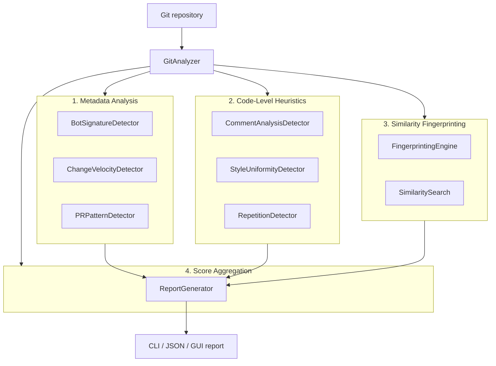
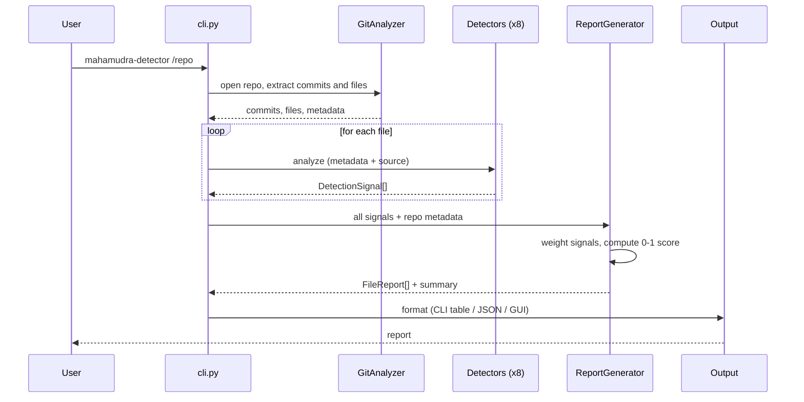

# Technical Analysis

Describes **how** `mahamudra-ai-code-detector` is built: architecture, pipeline, algorithms, I/O formats, and configuration.

For signal semantics, risk thresholds, and use cases see [analisi-funzionale.md](analisi-funzionale.md).

## Table of contents

1. [Layered architecture](#layered-architecture)
2. [Project structure](#project-structure)
3. [Analysis pipeline](#analysis-pipeline)
4. [Core algorithms](#core-algorithms)
5. [I/O formats](#io-formats)
6. [Configuration](#configuration)
7. [Tech stack](#tech-stack)

## Layered architecture

The analysis combines four independent layers of evidence. Each layer emits `DetectionSignal` objects that are aggregated downstream into a 0-1 score per file.



| Layer | Responsibility | Modules |
|---|---|---|
| 1. Metadata | Inspects git history: bot authors, commit velocity, PR patterns | `detectors/bot_signatures.py`, `change_velocity.py`, `pr_patterns.py` |
| 2. Code heuristics | Analyzes source: comment density, style uniformity, repetition | `detectors/comment_analysis.py`, `style_uniformity.py`, `repetition.py` |
| 3. Similarity | Fingerprints code chunks and looks them up against known patterns | `detectors/fingerprinting.py`, `similarity_search.py` |
| 4. Aggregation | Combines all signals into a 0-1 score per file and produces the report | `utils/report_generator.py` |

## Project structure

```
src/mahamudra_ai_code_detector/
├── cli.py                          # Click entry point
├── ui/
│   ├── app.py                      # Tkinter application
│   ├── constants.py                # Theme and constants
│   ├── app_context.py              # UI state
│   └── widgets/
│       ├── sidebar.py              # File browser
│       └── analysis_panel.py       # Results panel
├── models/
│   └── detection_models.py         # Pydantic models (DetectionSignal, ...)
├── detectors/
│   ├── bot_signatures.py           # Layer 1 — bot authors
│   ├── change_velocity.py          # Layer 1 — commit velocity
│   ├── pr_patterns.py              # Layer 1 — PR patterns
│   ├── comment_analysis.py         # Layer 2 — comments
│   ├── style_uniformity.py         # Layer 2 — style
│   ├── repetition.py               # Layer 2 — repetition
│   ├── fingerprinting.py           # Layer 3 — fingerprints
│   └── similarity_search.py        # Layer 3 — similarity
└── utils/
    ├── git_analyzer.py             # Git history extraction
    ├── report_generator.py         # Layer 4 — aggregation
    ├── json_output.py              # JSON serialization
    ├── cli_output.py               # Colored CLI tables
    └── index_manager.py            # Fingerprint index persistence
```

## Analysis pipeline

From repo path to final report:



Phases:

1. **Repo open** — `GitAnalyzer` uses GitPython to enumerate commits, authors, tracked files
2. **Per-file analysis** — each detector emits zero or more `DetectionSignal` with a `confidence` in 0-1
3. **Aggregation** — `ReportGenerator` combines signals with per-type weights and computes a 0-1 score per file
4. **Risk classification** — the score is mapped to `high` / `medium` / `low` using the configured thresholds (defaults 0.70 and 0.40)
5. **Output** — the report is serialized as a colored CLI table, JSON, or rendered by the GUI panel

## Core algorithms

### Multi-language comment detection

`CommentAnalysisDetector.analyze_comment_density` recognizes comments across several language families without an AST, using line prefixes plus state for block comments:

- Python / Ruby / Shell: `#`
- C-family (C, C++, C#, Java, JS, TS, Go, Rust): `//` and `/* ... */`
- HTML / XML: `<!-- ... -->`
- Block continuation lines: `*`

The handling of `/* ... */` block comments is **stateful** and orders the checks so that:

1. `*/` is checked first (closes the block, counts the line as a comment)
2. If `in_block_comment`, the line is a comment
3. `/*` opens a new block and counts the line as a comment

This ordering prevents `code(); /* ... */` from being miscounted or `*/` from staying active beyond its line.

AI-typical patterns (`"This function is..."`, `"Here we..."`, `TODO/FIXME/HACK/XXX`, `Author/Created/Modified`) use regexes with an alternating prefix `(?://|#)` and non-capturing groups `(?:...)` around the marker list, so the `|` alternation does not escape the comment context.

### Repetition detection with O(n) sampling

`RepetitionDetector.find_similar_functions` avoids O(n²) chunk-pairwise comparison via two combined mechanisms:

1. **Distributed sampling**: the step is sized so that at most `target_chunks` samples are produced, evenly spread across **the whole file**, not only its beginning:

   ```python
   target_chunks = 50
   available = max(1, len(lines) - self.min_chunk_size)
   step = max(1, available // target_chunks) if len(lines) > 100 else 1
   ```

2. **Pairwise cap**: pair comparisons are bounded to the first `target_chunks` chunks (`chunks[:target_chunks]`), which thanks to distributed sampling already cover the whole file.

For files under 100 lines the step stays at 1 (full fidelity). For larger files comparisons are capped at `target_chunks²/2 ≈ 1225`, independent of file size.

Chunk similarity is computed as **Jaccard similarity** over 3-character n-grams of the normalized code (leading/trailing whitespace stripped, empty lines collapsed).

### Fingerprinting

`FingerprintingEngine` splits the source into sliding chunks (`window_size` lines with `overlap` lines of overlap) and computes a SHA-256 hash of the normalized code per chunk. A persistent index (`IndexManager`) allows comparing a new repo against curated collections of AI or FOSS patterns.

Similarity search is approximate: chunks with different hashes but near-identical code will not match. For fuzzy matches the repetition layer (Jaccard) and the heuristics layer are used instead.

### Score aggregation

`ReportGenerator` combines per-file `DetectionSignal` objects with per-type weights, producing a 0-1 score. Default thresholds are `high_risk_threshold = 0.70`, `medium_risk_threshold = 0.40`; both are overridable.

The final score is a weighted average: signals with high `confidence` and high weight dominate; isolated low-confidence signals do not cross the high-risk threshold on their own.

## I/O formats

### CLI output

Colored table via `colorama` + `tabulate`. Layout: header with repo metadata, risk distribution, tables for `high` / `medium` risk, closing recommendations.

### JSON output

Top-level schema:

```json
{
  "metadata": {
    "timestamp": "ISO-8601",
    "repository": "name",
    "repository_path": "/path"
  },
  "summary": {
    "total_commits": 0,
    "total_files": 0,
    "ai_flagged_files": 0,
    "ai_risk_percentage": 0.0
  },
  "high_risk_files": [
    {
      "file_path": "src/x.py",
      "language": "Python",
      "ai_likelihood_score": 0.82,
      "signals": [
        {
          "signal_type": "COMMENT_DENSITY",
          "confidence": 0.75,
          "description": "...",
          "details": { }
        }
      ]
    }
  ],
  "medium_risk_files": [ ]
}
```

### GUI

State managed by `app_context.py`. The analysis thread is separate from the Tk main loop so the UI does not freeze. Results are pushed to the right panel via callbacks.

## Configuration

### Environment variables

```bash
MAHAMUDRA_BOT_THRESHOLD=0.9
MAHAMUDRA_STYLE_THRESHOLD=0.85
MAHAMUDRA_COMMENT_THRESHOLD=0.3
MAHAMUDRA_INDEX_DIR=~/.mahamudra/indexes
MAHAMUDRA_DISABLE_SIMILARITY=true
```

### Detector parameters

| Detector | Parameter | Default | Meaning |
|---|---|---|---|
| `BotSignatureDetector` | `rules["bots"]` | see module | Author/email/message patterns used to recognize bots |
| `ChangeVelocityDetector` | `insertion_threshold` | 500 | Lines inserted above which a commit is "large" |
| `ChangeVelocityDetector` | `burst_threshold` | 10 | Consecutive large commits that flag a burst |
| `CommentAnalysisDetector` | `high_density_threshold` | 0.3 | Comment/(code+comment) ratio above which the signal fires |
| `StyleUniformityDetector` | `uniformity_threshold` | 0.85 | Suspicious uniformity threshold |
| `RepetitionDetector` | `min_chunk_size` | 20 | Minimum lines to form a chunk |
| `RepetitionDetector` | `similarity_threshold` | 0.8 | Jaccard threshold above which two chunks are "similar" |
| `FingerprintingEngine` | `window_size` | 10 | Chunk size in lines |
| `FingerprintingEngine` | `overlap` | 3 | Overlap between adjacent chunks |
| `ReportGenerator` | `high_risk_threshold` | 0.75 | Score threshold for high risk |
| `ReportGenerator` | `medium_risk_threshold` | 0.45 | Score threshold for medium risk |

### Instantiation example

```python
from mahamudra_ai_code_detector.detectors.repetition import RepetitionDetector

detector = RepetitionDetector(min_chunk_size=30, similarity_threshold=0.85)
```

### CLI flags

```
mahamudra-detector REPO_PATH [OPTIONS]

  --output [cli|json]      Output format (default: cli)
  --output-file, -f FILE   Write to file instead of stdout
  --disable-similarity     Skip similarity search (faster)
  --verbose, -v            Detailed output with debug info
```

### Extending bot signatures

```python
from mahamudra_ai_code_detector.detectors.bot_signatures import BotSignatureDetector

detector = BotSignatureDetector()
detector.rules["bots"]["my-custom-bot"] = {
    "author_patterns": ["my-bot", "custom-bot"],
    "email_patterns": ["bot@mycompany.com"],
    "message_patterns": ["generated"],
    "tool_name": "My Custom Bot",
}
```

## Tech stack

| Component | Technology |
|---|---|
| Language | Python 3.9+ |
| Git access | GitPython |
| Data validation | Pydantic |
| CLI framework | Click |
| Terminal formatting | Colorama, Tabulate |
| GUI | Tkinter (stdlib) |
| Testing | Pytest |
| Config | PyYAML |

No external APIs — analysis is fully local.
